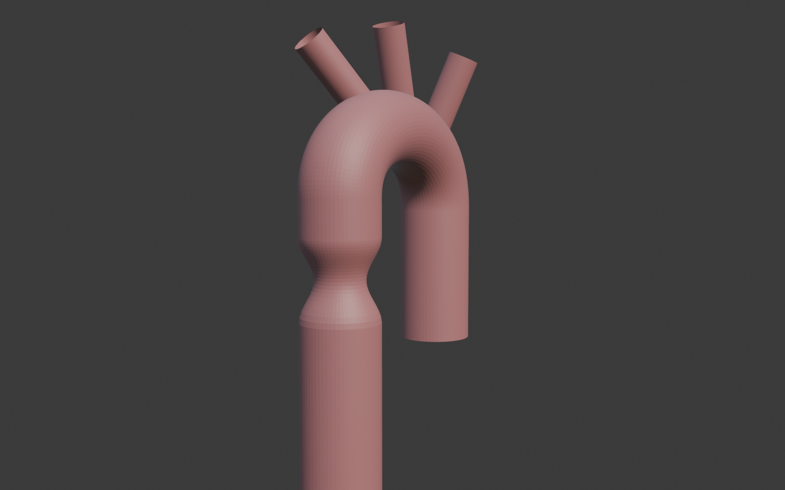

# Aorta geometry generator (Blender)

Parametric synthetic aorta STLs for CFD studies. Three CLI variants share
the same case-folder output layout and hand off identically to
`AortaCFD-app/scripts/package_cases.py`.

| Variant | Topology | Knobs | Use when |
|---|---|---|---|
| **v3** — `cli_v3.py` | Pipe U-bend, no branches | 12 | You just want a clean pipe U-bend STL |
| **v2** — `cli_v2.py` | Healthy arch, no branches | 18 + sample modes | ML training data, SynthAorta-comparable studies, sensitivity analysis |
| **v1** — `cli.py` | Aortic arch + 1-3 branches + coarctation | 21 | Pathology studies, branch sweeps |

Each variant ships exactly two example specs:

- `<specs_dir>/single_baseline*.json` — minimum baseline (the smallest
  runnable spec)
- `<specs_dir>/reference_*.json` — fully-annotated spec listing every
  knob with a `_comments` block that documents what each parameter does

`specs_v2/` carries one extra file (`sample_sobol_synthaorta_v2.json`)
because the figure-builders in `scripts_v2/` load it directly.

## Install

```bash
pip install -r requirements.txt        # numpy, scipy, numpy-stl + pyvista/matplotlib
```

Plus **Blender 3.x+** on your PATH:

| OS | Install |
|---|---|
| Linux (Debian/Ubuntu) | `sudo apt install blender` (3.x in 22.04+, 4.x via [snap](https://snapcraft.io/blender) or [download](https://www.blender.org/download/)) |
| Linux (Fedora/Arch)   | `sudo dnf install blender` / `sudo pacman -S blender` |
| macOS                 | `brew install --cask blender` or [download .dmg](https://www.blender.org/download/) |
| Windows               | [Installer from blender.org](https://www.blender.org/download/) — tick "Add to PATH" |

Verify with `blender --version` — should show 3.0 or newer. Without
Blender installed the CLI still works for `--list-params`, `--dry-run`,
validator checks, and the test suite, but no STL is produced.

If Blender lives outside the system PATH, point at it explicitly:

```bash
python cli_v2.py --blender /opt/blender-5.1/blender --spec ... --output ...
# or
export BLENDER=/opt/blender-5.1/blender
```

If you hit `error: externally-managed-environment` on Ubuntu 24.04+,
use a venv: `python3 -m venv .venv && source .venv/bin/activate`.

---

## Quick start (v3 — recommended for new users)

```bash
# Baseline pipe U-bend
python3 cli_v3.py --spec specs_v3/single_baseline_v3.json --output /tmp/v3 --yes

# Discover all 12 knobs
python3 cli_v3.py --list-params

# Override on the fly
python3 cli_v3.py --spec specs_v3/single_baseline_v3.json --output /tmp/v3_custom --yes \
    --param r_inlet=16 --param arch_R_c_mm=40 --param twist_deg=15

# Run the fully-annotated reference (every knob set explicitly)
python3 cli_v3.py --spec specs_v3/reference_v3.json --output /tmp/v3_ref --yes
```


*v3 baseline render — `cli_v3.py --spec specs_v3/single_baseline_v3.json`.*


*16 Sobol samples over the 8 v3 knobs, twist forced into `[10 deg, 30 deg]`
so every case shows visible non-planarity.*

### v3 knobs

| Knob | Default | What it is |
|---|---|---|
| `r_inlet` | 14 mm | Tube radius at the inlet (ascending) |
| `r_outlet` | 10 mm | Tube radius at the outlet (descending) |
| `arch_radius_mm` | 0 (auto) | Tube radius at the arch segment. 0 = midpoint of inlet/outlet. |
| `taper_mode` | `smoothstep` | Lumen transition: `smoothstep` / `linear` / `piecewise` |
| `arch_width_mm` | 90 mm | Horizontal arch extent |
| `arch_height_mm` | 45 mm | Arch peak height above ascending top |
| `arch_R_c_mm` | 0 (off) | Centerline curvature shortcut. > 0 auto-sets W=2R, H=R. |
| `arch_shape` | `circle` | `circle` (constraint H <= W <= 2H) or `ellipse` (any positive W, H) |
| `torsion_deg` | 0 deg | Rigid tilt of arch+descending around inlet z-axis |
| `twist_deg` | 0 deg | Gradual twist along arch (non-planar 3D curve) |
| `ascending_length` | 50 mm | Straight ascending length before arch |
| `descending_length` | 200 mm | Straight descending length after arch |

> **Two "radius" knobs — easy to confuse:**
> - `arch_radius_mm` = **tube** cross-section radius at the arch (like `r_inlet`, `r_outlet`)
> - `arch_R_c_mm` = **centerline curvature** radius (how sharply the path bends)

### v3 output per case

```
<output>/<case_id>/
  inlet.stl                    # ascending cap (radius = r_inlet)
  outlet1.stl                  # descending cap (radius = r_outlet)
  wall_aorta.stl               # vessel wall
  <case_id>.stl                # monolithic wall+caps (pre-split)
  <case_id>.json               # Blender-side sidecar (cap positions/normals)
  <case_id>_centreline.csv     # centerline points + radii (auto-exported)
  geometry.meta.json           # provenance (v3 inputs + v2 translation)
```

The centerline CSV has columns `index, x_mm, y_mm, z_mm, arc_length_mm, radius_mm`,
one row per centerline sample (~300 by default).

---

## v2 — healthy aorta, full parameter space

v2 has the full SynthAorta-compatible 18-knob parameter space (per-segment
radii, arch curvature, lengths, non-planar Fourier multipliers, mesh
resolution) plus Sobol / LHS / random sampling. Use it when you need ML
training data, sensitivity analysis, or distributions grounded in clinical
literature.

```bash
# Discover parameters
python cli_v2.py --list-params

# Smoke test: one geometry at SynthAorta means
python cli_v2.py --spec specs_v2/single_baseline_v2.json --output /tmp/v2_single

# Fully-annotated reference (every knob explicit)
python cli_v2.py --spec specs_v2/reference_v2.json --output /tmp/v2_ref --yes

# 256-case Sobol over a 7-D SynthAorta-matched cube (planar centrelines) — ~13 min
python cli_v2.py --spec specs_v2/sample_sobol_synthaorta_v2.json \
    --output outputs/v2_sobol_planar_256 --yes
```

For a quick smoke run before the full Sobol, add `--limit 8` (~25 s).

### v2 vs v1 at a glance

|  | v1 (`cli.py`) | v2 (`cli_v2.py`) |
|---|---|---|
| Topology | Aortic arch + 1-3 supra-aortic branches | Aortic arch only, no branches |
| Pathology | Coarctation + proximal hypoplasia | Healthy only |
| Main radius | Single `diameter` (constant along the tube) | Three radii (asc/arch/desc) with smoothstep taper |
| Arch curvature | Euclidean `arch_height` + `arch_span` | Clinical `arch_R_c` + `arch_angle_deg` |
| Sample mode | Uniform between `low`/`high` per parameter | Normal / Gumbel / Uniform via `distribution_overrides`; defaults from SynthAorta Table I |
| Output patches | `inlet.stl`, `outlet1..N.stl`, `wall_aorta.stl` | `inlet.stl`, `outlet1.stl`, `wall_aorta.stl` |
| Parameter count | 21 | 18 (10 planar + 2 non-planar Fourier + extras) |
| Generator | `blender_aorta_like_generator.py` | `blender_aorta_v2.py` |

### v2 pipeline overview

1. **Centreline** = three concatenated segments (ascending straight, arch
   arc, descending straight). `arch_R_c` is the circle radius;
   `arch_angle_deg` is the subtended angle.
2. **Non-planar Fourier** (optional, gated on `delta_3 != 0` or
   `delta_4 != 0`) adds an out-of-plane y-component per SynthAorta Eq 13
   (Bošnjak et al. 2025).
3. **Per-point radii** are blended between segment radii using
   `taper_mode` (smoothstep / linear / piecewise).
4. **Tube** is constructed with rotation-minimising frames (Wang 2008
   double-reflection) so cross-sections don't twist artificially.
5. **STL + sidecar JSON** is exported with cap normals/positions that
   `split_patches.py` uses to produce `inlet.stl`, `outlet1.stl`,
   `wall_aorta.stl`.

### v2 spec schema

```json
{
  "schema_version": "2.0",
  "name": "your_experiment_name",
  "mode": "single|sweep|sample|grid",
  "geometry": "healthy_arch_v2",

  "params": { ... },     // single mode: explicit values
                         // sample mode: {paramname: {}} (use default dist)
                         //              {paramname: {"low": ..., "high": ...}} (uniform)

  "distribution_overrides": {   // sample mode only — override per-parameter
    "r_ascending": {"type": "normal", "mean": 13.7, "std": 2.3, "low": 8, "high": 22},
    "arch_R_c":    {"type": "gumbel", "loc": 40.4, "scale": 2.4, "low": 25, "high": 60}
  },

  "sweep": { "param": "...", "low": 0, "high": 1, "n": 10 },
  "grid":  { "params": {"name1": [v1, v2], "name2": [v3, v4]} },

  "sampler": "sobol|lhs|random",
  "n_cases": 256,
  "seed": 42,

  "fixed": { ... }       // parameters held constant across all cases
}
```

When a sample-mode param entry is `{}` (empty dict), the sampler uses
the SynthAorta-aligned default distribution declared in
`cli_v2.py:PARAMETERS[name]["default_dist"]`. This is the recommended
default.

### Sample size — how many cases do I need?

The shipped Sobol spec defaults to **N = 256** (Sobol-native power of 2
above the 30·dim rule of thumb at dim=7). Compute scales linearly at
**~3 s/case** on a modest workstation:

| N | Wall-clock |
|---|---|
| 100 | ~5 min |
| 256 (default) | ~13 min |
| 512 | ~26 min |
| 1024 | ~52 min |

| Downstream use | N=256 verdict |
|---|---|
| Visual diversity | Plenty |
| Marginal-distribution validation (KS test vs published) | Plenty |
| Joint-distribution independence check (Pearson \|r\| < 2/sqrt(N) ~ 0.125) | Plenty |
| ML surrogate training (small MLP, <=1e4 weights) | Comfortable |
| ML surrogate training (GNN, neural operator) | Tight — 500-2000 typical |
| Sparse-PCE Sobol-index sensitivity at 7-D | Above rule-of-thumb (30·dim = 210) |
| Full-quadratic PCE | Bump to 512 or 1024 |

To bump, edit `n_cases` in the spec and re-run.

### Generating PyVista figures from a v2 cohort

```bash
/home/mchi4jw4/GitHub/.venv/bin/python scripts_v2/build_v2_gallery_pyvista.py \
    --planar-cohort   outputs/v2_sobol_planar_256
# -> figures/v2_cohort_diversity_gallery.png + v2_single_hero.png
```

The script auto-skips any cohort that doesn't exist on disk and picks
a near-square gallery grid. Use `--gallery-grid 5x5` for an explicit
layout.

---

## v1 — branched arch with coarctation



```bash
python3 cli.py --spec specs/single_baseline.json --output /tmp/v1 --yes
python3 cli.py --spec specs/reference_v1.json --output /tmp/v1_ref --yes
python3 cli.py --list-params         # 21 knobs
```

See `PARAMETERS.md` for the full v1 knob list with workshop-sensible
ranges and `figures/severity_sweep_demo.png` for the canonical
pathology-sweep output.

---

## Block A — what this is in the bigger picture

This repo is **Block A** of the four-block aortic CFD workflow:

1. **A. Geometry** — this repo (v1/v2/v3) → STL cases
2. **B. Packaging** — `AortaCFD-app/scripts/package_cases.py` stamps config on each case
3. **C. CFD** — `AortaCFD-app/run_batch.py` runs OpenFOAM
4. **D. Aggregation** — `AortaCFD-app/scripts/compare_cohort.py` joins results

A and B are decoupled — hand-off is by filesystem (a folder of cases),
not Python imports.

## Output per case (all variants)

```
<output>/<case_id>/
  inlet.stl              # inlet patch
  outlet1.stl            # outlet patch (outlet1..N for v1 with branches)
  wall_aorta.stl         # vessel wall
  geometry.meta.json     # parameters, derived geometry, patch checksums
```

## Branches

- `main` — latest (v1 + v2 + v3)
- `v2` — frozen snapshot when v2 was complete (v1 + v2 only)
- `v1` — frozen snapshot at v1-complete (v1 only)

## Files

| File | Purpose |
|---|---|
| `cli.py` | v1 orchestrator (branched + coarctation) |
| `cli_v2.py` | v2 orchestrator (healthy + Sobol/LHS sampling) |
| `cli_v3.py` | v3 orchestrator (12-knob U-bend; wraps `blender_aorta_v2.py`) |
| `blender_aorta_like_generator.py` | v1 Blender script |
| `blender_aorta_v2.py` | v2/v3 Blender script (3-segment tube, RMF, smoothstep taper, SynthAorta Eq 13) |
| `sampler.py` | Sobol / LHS / random samplers |
| `split_patches.py` | STL flood-fill patch splitter |
| `PARAMETERS.md`    | v1 parameter reference (auto-generated) |
| `PARAMETERS_v2.md` | v2 parameter reference with literature citations |
| `specs/*.json`     | v1 example specs (baseline + reference) |
| `specs_v2/*.json`  | v2 example specs (baseline + reference + sample_sobol) |
| `specs_v3/*.json`  | v3 example specs (baseline + reference) |
| `scripts_v2/`      | Figure builders (PyVista gallery, SynthAorta KS/pairplot) |
| `tests/`           | pytest suites, no Blender required |
