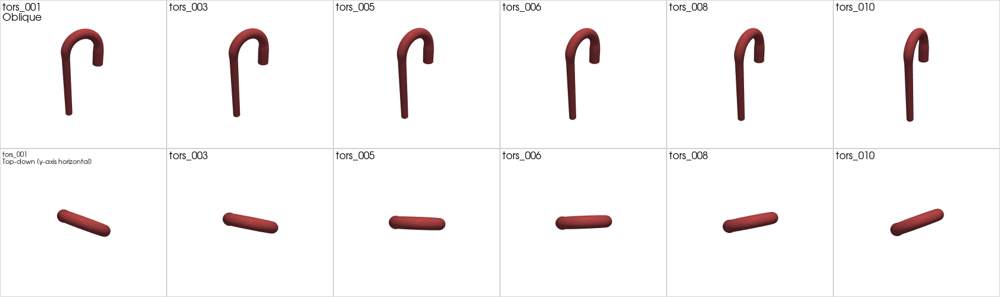

# Aorta geometry generator — v3 (5-knob minimal interface)

The shortest path from "I want an aorta with these dimensions" to an STL.
**Five primary knobs**, two optional length knobs, everything else fixed
at workshop-quality defaults.


*v3 baseline render. The same 5-knob input produces the STL on the left
in ~3 seconds.*



*Sweeping `torsion_deg` from -20° to +20° (every other case shown). The
oblique row barely shows the tilt; the top-down row makes it obvious
that the descending tube swings around the inlet z-axis. This is v3's
only out-of-plane mechanism — for SynthAorta-style Fourier wobble, drop
down to v2.*

| Knob | What it controls | Default |
|---|---|---|
| `r_inlet` | inlet (ascending) radius [mm] | 14.0 |
| `r_outlet` | outlet (descending) radius [mm] | 10.0 |
| `arch_width_mm` | arch horizontal extent (ascending → descending) [mm] | 90.0 |
| `arch_height_mm` | arch peak height above ascending top [mm] | 45.0 |
| `torsion_deg` | arch tilt around the inlet z-axis [deg] | 0.0 |
| `ascending_length` (optional) | straight ascending length [mm] | 50.0 |
| `descending_length` (optional) | straight descending length [mm] | 200.0 |

That's it. No taper modes, no R_c-vs-angle decision, no Fourier multipliers,
no mesh resolution. Use [`cli_v2.py`](./README_v2.md) when you need any of
that.

## Quick start

```bash
# Discover the 5+2 knobs
python3 cli_v3.py --list-params

# Default baseline (matches outputs/v2_dim/baseline_v2 in dimensions)
python3 cli_v3.py --spec specs_v3/single_baseline_v3.json --output /tmp/v3

# Tweak by CLI
python3 cli_v3.py --spec specs_v3/single_baseline_v3.json --output /tmp/v3_custom \
    --param r_inlet=16 --param r_outlet=11 \
    --param arch_width_mm=100 --param arch_height_mm=50 \
    --param torsion_deg=15

# Sweep torsion from -20° to +20° (10 cases) — the standard "out-of-plane variation" study
python3 cli_v3.py --spec specs_v3/sweep_torsion_v3.json --output /tmp/v3_torsion --yes
```

## How v3 → v2

v3 is a thin wrapper. Internally each case is translated to v2 parameters
before invoking `blender_aorta_v2.py`:

| v3 | v2 |
|---|---|
| `r_inlet` | `r_ascending` |
| `r_outlet` | `r_descending` |
| `arch_width_mm` | `arch_span_mm` (then resolved to `arch_R_c` + `arch_angle_deg`) |
| `arch_height_mm` | `arch_height_mm` (then resolved to `arch_R_c` + `arch_angle_deg`) |
| `torsion_deg` | `arch_tilt_deg` |
| `ascending_length` | `ascending_length` |
| `descending_length` | `descending_length` |

Plus auto-derived: `r_arch = (r_inlet + r_outlet) / 2`, so the main lumen
tapers smoothly inlet → midpoint → outlet.

Plus v2 defaults fixed in `cli_v3.V2_FIXED`:
- `taper_mode = "smoothstep"`
- `junction_blend_mm = 12.0`
- `delta_3 = 0.0`, `delta_4 = 0.0` (no Fourier)
- `segments_radial = 96`, `curve_samples = 300`

## Output

```
<output>/<case_id>/
  inlet.stl              # cap fan at z=0 (radius = r_inlet)
  outlet1.stl            # cap fan at the descending end (radius = r_outlet)
  wall_aorta.stl         # the vessel wall
  geometry.meta.json     # records BOTH the v3 inputs and the derived v2 params
```

The `geometry.meta.json` carries the original v3 parameter dict you supplied
plus a `_translated_to_v2` sub-dict showing what `blender_aorta_v2.py`
actually received — full traceability for reviewers.

## Modes

v3 supports only **single** and **sweep**. For Sobol / LHS / grid sampling,
use [`cli_v2.py`](./README_v2.md) and the `specs_v2/sample_sobol_synthaorta_*.json`
specs.

### How many Sobol samples would v3 need (if we added it)?

5-D parameter space is much cheaper than v2's 9-D. Rule-of-thumb:

| Use case | N |
|---|---|
| Visual diversity gallery | 64-128 |
| Marginal validation / pairplot | 128-256 |
| Sparse-PCE Sobol-index sensitivity (N ≥ 30·dim = 150) | **256** (Sobol-native) |
| Full-quadratic PCE | 512+ |

**256 is the safe default for 5-D Sobol.** Compute time at ~3 s/case
gives ~13 min for 256 cases. Currently v3 doesn't expose sample mode —
file an issue or ask if you need it; in the meantime use v2 with the
distributions there (and ignore the v2 knobs v3 hides).

## Validation rules (the closed-form inverse)

`arch_width_mm` and `arch_height_mm` are translated to v2's `arch_R_c` +
`arch_angle_deg` via:

```
R_c   = arch_height_mm
θ     = arccos(1 − arch_width_mm / arch_height_mm)
```

This requires **`arch_height_mm ≤ arch_width_mm ≤ 2 · arch_height_mm`**
(arch subtended angle θ ∈ [90°, 180°]). Outside this window, you get a
clear error and a pointer to `cli_v2.py` for over-arched (θ > 180°)
geometries.

## Files

| File | Purpose |
|---|---|
| `cli_v3.py` | Minimal 5+2 knob orchestrator |
| `specs_v3/single_baseline_v3.json` | Reference baseline (matches user dim test) |
| `specs_v3/sweep_torsion_v3.json` | 10-step torsion sweep [-20°, +20°] |
| `tests/test_v3.py` | 16 tests, no Blender required |
