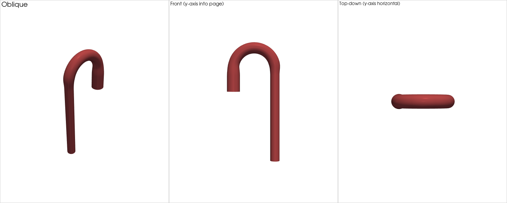
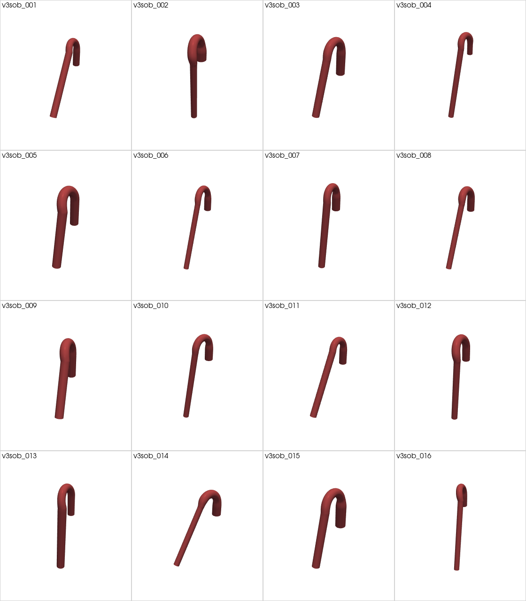
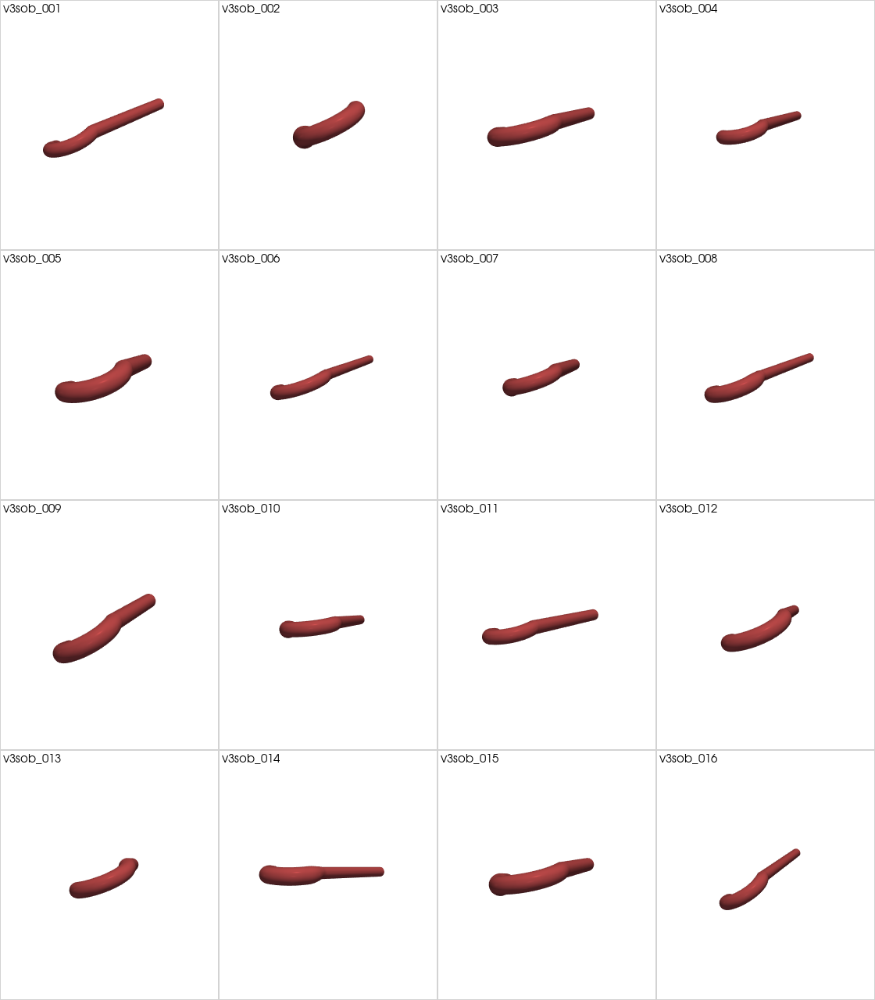
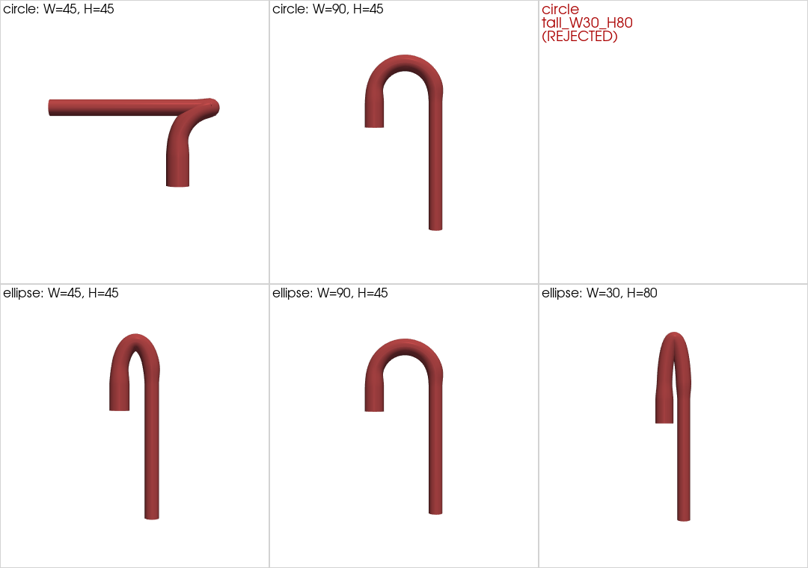
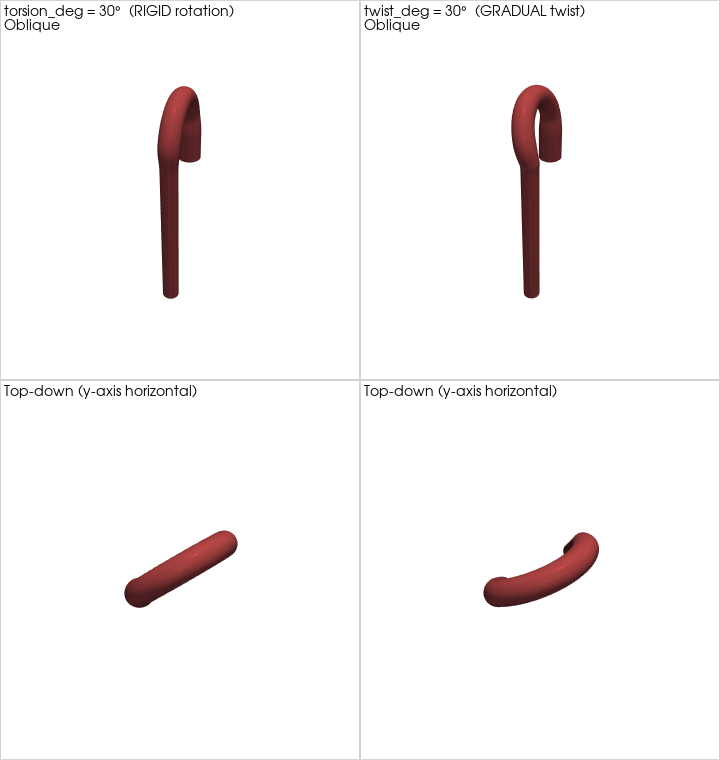

# Aorta geometry generator — v3 (minimal pipe-U-bend interface)

The shortest path from "I want a U-bend pipe with these dimensions" to a
ready-to-mesh STL. **Six primary knobs**, two optional length knobs,
everything else fixed at workshop-quality defaults.



*v3 baseline — the canonical U-bend pipe. The same 8 inputs produce the
STL above in ~3 seconds via `cli_v3.py --spec specs_v3/single_baseline_v3.json`.*

## The 9 knobs

| # | Knob | Default | What it controls |
|---|---|---|---|
| 1 | `r_inlet` | 14.0 mm | inlet (ascending) radius |
| 2 | `r_outlet` | 10.0 mm | outlet (descending) radius |
| 3 | `arch_width_mm` | 90.0 mm | arch horizontal extent (ascending → descending) |
| 4 | `arch_height_mm` | 45.0 mm | arch peak height above ascending top |
| 5 | `arch_shape` | `"circle"` | `"circle"` (constraint H ≤ W ≤ 2H) or `"ellipse"` (independent W + H) |
| 6 | `torsion_deg` | 0.0° | **rigid** arch tilt around inlet z-axis (arch stays planar in a rotated plane) |
| 7 | `twist_deg` | 0.0° | **gradual** twist along the arch (arch becomes a non-planar 3D curve) |
| 8 | `ascending_length` (opt) | 50.0 mm | straight ascending length before arch |
| 9 | `descending_length` (opt) | 200.0 mm | straight descending length after arch |

That's it. No taper modes, no R_c vs angle decision, no Fourier multipliers,
no mesh-resolution knobs. Use [`cli_v2.py`](./README_v2.md) when you need any
of that.

---

## Install (one-time)

### Python deps

```bash
# Easiest: install everything from the pinned list
pip install -r requirements.txt

# Or hand-install the minimum:
pip install numpy scipy numpy-stl
# Optional, only for the PyVista gallery / figure scripts:
pip install pyvista matplotlib
```

Tested with Python 3.10–3.12.

**Common gotcha**: the package is named `numpy-stl` (with hyphen) but
the import is `from stl import mesh`. If you `pip install stl` by
mistake you'll get an unrelated package and see `No module named 'stl'`
at runtime — uninstall it (`pip uninstall stl`) and install `numpy-stl`.

**On Debian/Ubuntu 24.04+** you may hit `error: externally-managed-environment`
when using the system Python — use a venv:

```bash
python3 -m venv .venv
source .venv/bin/activate
pip install -r requirements.txt
```

### Blender (required for STL generation)

`cli_v3.py` launches Blender in headless mode (`blender -b -P …`) to build each
geometry. Without Blender installed, `--list-params` / `--dry-run` / tests still
work but no STLs come out.

| OS | Command |
|---|---|
| **Windows** | Download installer from [blender.org/download](https://www.blender.org/download/); during install, check **"Add to PATH"** (or add the install folder to PATH manually afterwards) |
| **macOS** | `brew install --cask blender`   (or download `.dmg` from blender.org and drop into Applications) |
| **Linux** (Debian/Ubuntu) | `sudo apt install blender` |
| **Linux** (Fedora) | `sudo dnf install blender` |
| **Linux** (Arch) | `sudo pacman -S blender` |
| **Any Linux** | `sudo snap install blender --classic` (newest version) |

Verify with `blender --version` — should print 3.0 or newer.

If Blender is installed but not on PATH, point at it explicitly:

```bash
# One-time per session (any OS):
export BLENDER=/opt/blender-5.1/blender   # Linux/macOS
# (Windows cmd: set BLENDER=C:\path\to\blender.exe)

# Or per-invocation:
python3 cli_v3.py --blender /opt/blender-5.1/blender --spec ... --output ...
```

**Note:** We use Blender purely as a mesh kernel (vertex/face construction
+ triangulate modifier + STL exporter). No materials, lighting, animation, or
GPU rendering — so any Blender install works, including ones with no GPU
drivers (e.g. on a headless server).

---

## How to generate a pipe U-bend (3 ways)

### Way 1 — One geometry from defaults (smoke test)

```bash
cd /home/mchi4jw4/GitHub/aortacfd-geomgen

python3 cli_v3.py \
    --spec specs_v3/single_baseline_v3.json \
    --output outputs/v3_baseline \
    --yes

# Outputs (one folder per case):
#   outputs/v3_baseline/baseline_v3/
#     baseline_v3.stl            ← monolithic wall + caps
#     inlet.stl                  ← inlet cap fan
#     outlet1.stl                ← outlet cap fan
#     wall_aorta.stl             ← the U-bend wall
#     geometry.meta.json         ← v3 knobs + v2 translation
```

Open `wall_aorta.stl` in ParaView, Blender, or any STL viewer.

### Way 2 — Dial the 8 knobs by CLI (one-shot custom geometry)

```bash
python3 cli_v3.py \
    --spec specs_v3/single_baseline_v3.json \
    --output outputs/my_custom_pipe \
    --yes \
    --param r_inlet=16 \
    --param r_outlet=12 \
    --param arch_width_mm=100 \
    --param arch_height_mm=50 \
    --param torsion_deg=10 \
    --param twist_deg=20 \
    --param ascending_length=60 \
    --param descending_length=220
```

Any subset of knobs you omit takes its default. The single spec file
is just a starting point; `--param` overrides everything.

### Way 3 — Sweep one knob across a range (10 cases)

```bash
# Sweep torsion (RIGID tilt) from -20° to +20° in 10 steps
python3 cli_v3.py --spec specs_v3/sweep_torsion_v3.json --output outputs/v3_torsion --yes

# Sweep twist (GRADUAL twist along arch) from -30° to +30° in 10 steps
python3 cli_v3.py --spec specs_v3/sweep_twist_v3.json --output outputs/v3_twist --yes
```

Each sweep writes 10 case folders + a `sweep_manifest.csv` row per case.

---

## How to render a gallery of generated pipes

Once you have a cohort directory (single, sweep, or the Sobol cohort
below), render it with PyVista:

```bash
# Use the project venv (PyVista is not in the system Python)
/home/mchi4jw4/GitHub/.venv/bin/python scripts_v2/build_v2_gallery_pyvista.py \
    --planar-cohort outputs/v3_torsion \
    --hero-case outputs/v3_torsion/tors_005

# Output PNGs land in figures/:
#   v2_cohort_diversity_gallery.png   ← grid view
#   v2_single_hero.png                ← 3-view hero of the chosen case
```

---

## Sobol sampling (covers all 8 knobs at once)

v3 itself has only `single` + `sweep` modes — but you can run a Sobol
sweep over the same 8 dimensions via `cli_v2.py` and a pre-built spec:

```bash
# 16-case Sobol over the 8 v3-equivalent dimensions, with arch_twist_deg
# forced into Uniform(10°, 30°) so EVERY case has visible gradual twist.
python3 cli_v2.py \
    --spec specs_v2/sample_sobol_v3_8d_gradual_twist.json \
    --output outputs/v3_sobol_gallery \
    --yes

# Then render two 4x4 gallery figures (oblique + top-down):
/home/mchi4jw4/GitHub/.venv/bin/python scripts_v2/build_v3_sobol_gallery.py
# → figures/v3_sobol_gallery_with_twist.png  (oblique)
# → figures/v3_sobol_gallery_topdown.png     (top-down — twist hooks visible)
```



*16 Sobol-sampled pipe U-bends over the 8 v3 knobs. Visible diversity
in radii, arch shape, lengths, torsion, and twist.*



*Top-down view of the same 16 cases. **Every silhouette is a curved
hook, not a straight sausage** — proof that `twist_deg` is non-zero in
all cases, producing genuine non-planar 3D arches.*

### How many Sobol samples does v3 need?

8-D parameter space — rule of thumb:

| Use case | N |
|---|---|
| Quick visual gallery | **16** (used above) |
| Diversity gallery | 64-128 |
| Marginal validation / pairplot | 128-256 |
| Sparse-PCE / Sobol-index sensitivity (N ≥ 30·dim = 240) | **256** (Sobol-native) |
| Full-quadratic PCE | 512+ |

Compute time at ~3 s/case: 16 → ~50 s, 64 → ~3 min, 256 → ~13 min,
512 → ~26 min. To use a different `N`, edit `n_cases` in
`specs_v2/sample_sobol_v3_8d_gradual_twist.json` and rerun.

---

## arch_shape — circle vs ellipse (independent W and H)



*Same (W, H) inputs, two interpretations. Top row = `arch_shape="circle"`,
bottom row = `arch_shape="ellipse"`.*

- **`circle` (default)** — arch is a **circular arc** with R_c = H and
  subtended angle θ = arccos(1 − W/H). This requires `H ≤ W ≤ 2H` (the
  constraint baked into the closed-form inverse). Outside that window
  you get a clear error.
- **`ellipse`** — arch is a **half-ellipse** parametrised as
  `x(φ) = (W/2)·(1 − cos φ)`, `z(φ) = z₀ + H·sin(φ)`, with `φ ∈ [0, π]`.
  W and H are independent semi-axes — any positive combination works,
  including tall narrow (W < H) and very wide flat (W ≫ 2H).

Use ellipse mode whenever you need:
- W < H (tall narrow arch — circle mode rejects it)
- W ≫ 2H (very wide flat arch — circle mode rejects it)
- Exact W and H to match a clinical measurement without worrying about
  arc-angle constraints

Use circle mode (the default) whenever you want a true circular arc with
clinically-meaningful radius of curvature R_c (matches SynthAorta's
parametrisation).

```bash
# A circle-mode geometry (default)
python3 cli_v3.py --spec specs_v3/single_baseline_v3.json --output /tmp/v3_circle --yes

# An ellipse-mode tall narrow geometry (W=30, H=80)
python3 cli_v3.py --spec specs_v3/single_ellipse_v3.json --output /tmp/v3_ellipse --yes
# or via CLI override on the default spec:
python3 cli_v3.py --spec specs_v3/single_baseline_v3.json --output /tmp/v3_ellipse --yes \
    --param arch_shape=ellipse \
    --param arch_width_mm=30 \
    --param arch_height_mm=80
```

## Torsion vs twist — what's the difference?



*Both at 30°: rigid `torsion_deg` (left) vs gradual `twist_deg` (right).
**Bottom row (top-down) tells the story.** Torsion projects as a
straight sausage at 30° to the y-axis — the arch is still planar, just
in a rotated plane. Twist projects as a curved hook — the arch is now a
non-planar 3D curve, because each centreline point is rotated by a
different angle linearly from 0 at the ascending top to 30° at the
descending start. Use `torsion_deg` for anatomical leftward arch tilt;
use `twist_deg` for helical descending. Both compose if you set both.*

---

## How v3 translates to v2 under the hood

v3 is a thin wrapper. Internally each case is converted to v2 parameter
names before `blender_aorta_v2.py` is invoked.

| v3 knob | v2 parameter |
|---|---|
| `r_inlet` | `r_ascending` |
| `r_outlet` | `r_descending` |
| `arch_width_mm` | `arch_span_mm` → `arch_R_c` + `arch_angle_deg` via closed-form inverse |
| `arch_height_mm` | `arch_height_mm` → `arch_R_c` + `arch_angle_deg` |
| `torsion_deg` | `arch_tilt_deg` |
| `twist_deg` | `arch_twist_deg` |
| `ascending_length` | `ascending_length` |
| `descending_length` | `descending_length` |

Auto-derived for you: `r_arch = (r_inlet + r_outlet) / 2`, so the main
lumen tapers smoothly inlet → midpoint → outlet.

Fixed at v3 defaults (not exposed):

- `taper_mode = "smoothstep"`
- `junction_blend_mm = 12.0` (Bezier-blended corners — no visible folds)
- `delta_3 = 0.0`, `delta_4 = 0.0` (no SynthAorta Fourier wobble)
- `segments_radial = 96`, `curve_samples = 300`

## Closed-form inverse — when v3 fails over to v2

`arch_width_mm` and `arch_height_mm` are translated to `arch_R_c` +
`arch_angle_deg` via:

```
R_c = arch_height_mm
θ   = arccos(1 − arch_width_mm / arch_height_mm)
```

This requires `arch_height_mm ≤ arch_width_mm ≤ 2 · arch_height_mm` (arch
subtended angle θ ∈ [90°, 180°]). Outside this range you get a clear
error message pointing you at `cli_v2.py` for over-arched geometries
(θ > 180°).

---

## Output schema per case

```
<output>/<case_id>/
  <case_id>.stl              # monolithic STL (root CAD file)
  <case_id>.json             # Blender-side sidecar (cap positions, normals)
  inlet.stl                  # split: inlet cap (radius = r_inlet)
  outlet1.stl                # split: outlet cap (radius = r_outlet)
  wall_aorta.stl             # split: vessel wall
  geometry.meta.json         # provenance — both v3 knobs and v2 translation
```

`geometry.meta.json` example for the baseline:

```json
"params": {
  "r_inlet": 14.0,
  "r_outlet": 10.0,
  "arch_width_mm": 90.0,
  "arch_height_mm": 45.0,
  "torsion_deg": 0.0,
  "twist_deg": 0.0,
  "_translated_to_v2": {
    "r_ascending": 14.0, "r_descending": 10.0, "r_arch": 12.0,
    "arch_R_c": 45.0, "arch_angle_deg": 180.0,
    "arch_tilt_deg": 0.0, "arch_twist_deg": 0.0,
    "taper_mode": "smoothstep", "junction_blend_mm": 12.0,
    "delta_3": 0.0, "delta_4": 0.0,
    "segments_radial": 96, "curve_samples": 300
  }
}
```

This double-record means you can replay any geometry exactly by either
v3 or v2 — full traceability.

---

## Files

| File | Purpose |
|---|---|
| `cli_v3.py` | The 8-knob orchestrator |
| `specs_v3/single_baseline_v3.json` | Canonical baseline pipe U-bend |
| `specs_v3/sweep_torsion_v3.json` | 10-step torsion sweep [-20°, +20°] |
| `specs_v3/sweep_twist_v3.json` | 10-step gradual-twist sweep [-30°, +30°] |
| `specs_v2/sample_sobol_v3_8d_gradual_twist.json` | 16-case Sobol over 8 v3 knobs (v2-syntax) |
| `scripts_v2/build_v3_sobol_gallery.py` | PyVista 4×4 gallery renderer for the Sobol cohort |
| `tests/test_v3.py` | 17 tests for the v3 schema + translation (no Blender required) |
